# Voice Commnad IoT Lamp Control with ESP8266 and MQTT

In a modern smart home, control needs to be fast and easy. Have you ever thought about controlling your devices just by speaking, from anywhere?

This project makes that possible. We connect the digital world (voice commands, web apps) with the physical world (lamps, relays) using simple, strong technology. By using the **ESP8266 microcontroller** and the **MQTT protocol**, we build a system that works quickly and reliably.

The main goal is to take an **ON/OFF command**—either from a web app or your voice—and execute it instantly on the hardware.

Have you ever imagined controlling your home devices from anywhere, just by sending a quick message?  

This project brings that concept to life by connecting the **digital world** (applications, servers) and the **physical world** (lamps) using **NodeMCU ESP8266** and **MQTT (Message Queuing Telemetry Transport)**.

Rreal-time system that receives ON/OFF commands from an external app (like our **Voice Command feature**), sends them through an MQTT broker, and makes the action happen right away on the ESP8266 hardware.


- [Voice Commnad IoT Lamp Control with ESP8266 and MQTT](#voice-commnad-iot-lamp-control-with-esp8266-and-mqtt)
    - [Voice Command Feature](#voice-command-feature)
  - [2. System Architecture](#2-system-architecture)
    - [Communication Flow Diagram (Updated)](#communication-flow-diagram-updated)
    - [Project Folder Structure (Updated)](#project-folder-structure-updated)
  - [3. Hardware Requirements](#3-hardware-requirements)
    - [Wiring Diagram (Schematic)](#wiring-diagram-schematic)
  - [4. Software Requirements](#4-software-requirements)
  - [5. Configuration and Deployment](#5-configuration-and-deployment)
    - [5.1. MQTT Broker Deployment (Using Docker)](#51-mqtt-broker-deployment-using-docker)
    - [5.2. Arduino Code Configuration (main.ino)](#52-arduino-code-configuration-mainino)
    - [5.3. Upload to ESP8266](#53-upload-to-esp8266)
    - [Relay Logic](#relay-logic)
    - [5.4. MQTT Message Structure (Payload)](#54-mqtt-message-structure-payload)
  - [7. Frontend Application](#7-frontend-application)
  - [8. System Demonstration and Testing](#8-system-demonstration-and-testing)
    - [A. Confirming ESP8266 Connection](#a-confirming-esp8266-connection)
    - [B. Sending Commands from the Publisher (Backend App / MQTT Client)](#b-sending-commands-from-the-publisher-backend-app--mqtt-client)
      - [**Option 1: Using Backend Server (Node.js + Express)**](#option-1-using-backend-server-nodejs--express)
      - [**Option 2: Using MQTT Client (MQTT Explorer)**](#option-2-using-mqtt-client-mqtt-explorer)
      - [**Option 3: Frontend Application**](#option-3-frontend-application)
    - [C. Microcontroller Running Demo (Serial Monitor)](#c-microcontroller-running-demo-serial-monitor)


### Voice Command Feature

This feature lets the user send **ON** or **OFF** commands to the lamp simply by talking into the web application on their smartphone's browser.

|| Component | Description |
|------------|-------------|
| **Voice Command App** | The web app (frontend) that captures the user's voice input. |
| **Voice Processing** | The app translates the speech (e.g., “turn off the lamp”) into a text command: `ON` or `OFF`. |
| **Communication** | The detected ON/OFF command is then sent to the NodeJS Server using a REST API (JSON). |

<p align="left">
  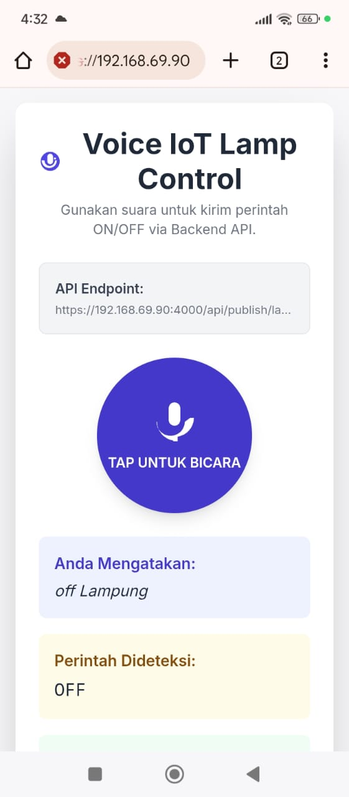
</p>

## 2. System Architecture

The system uses a **publish/subscribe (Pub/Sub)** model through an **MQTT Broker**, ensuring fast and reliable message delivery.

###  Communication Flow Diagram (Updated)

1. The Voice Command App hears the voice and detects the command (ON/OFF).  
2. The command is sent over the Internet to the NodeJS Server using REST API (JSON).  
3. The NodeJS Server (**Publisher**) sends the command to the MQTT Broker Server.  
4. The ESP8266 Microcontroller (**Subscriber**) is connected via WiFi and the MQTT Protocol.  
5. The ESP8266 executes the received command to control the lamp (Relay).

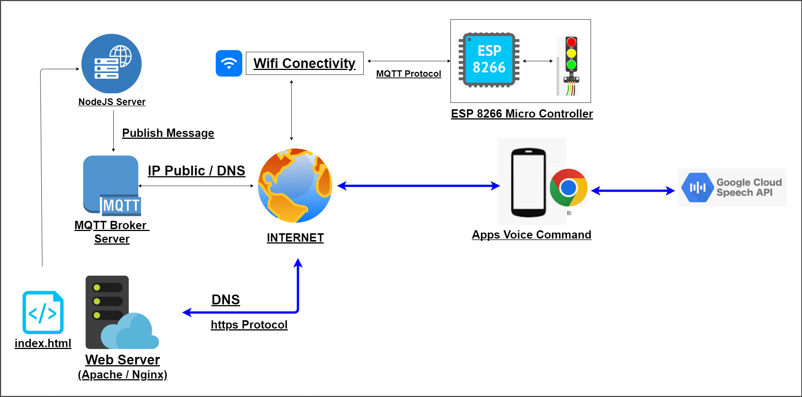

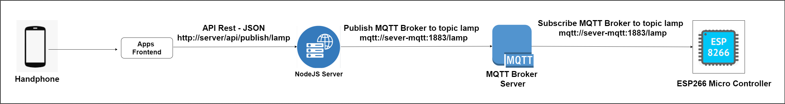

### Project Folder Structure (Updated)

```
.
├── backend/
│   ├── node_modules/
│   ├── app.js
│   ├── package-lock.json
│   └── package.json
├── frontend/
│   └── index.html // Web app for Voice Command
├── microcontroller/
│   └── main/
│       └── main.ino  // Arduino code for ESP8266
└── README.md
````

| Folder/File | Description |
|--|-|
| **backend/app.js** | NodeJS Server: handles REST API requests and sends commands to the MQTT Broker. |
| **frontend/index.html** | The Voice Command web app, used on a smartphone or browser. |
| **microcontroller/main/main.ino** | Arduino code for ESP8266 (Subscriber) that receives and executes MQTT commands. |


## 3. Hardware Requirements

| Hardware Component | Description |
|--|-|
| **Microcontroller** | NodeMCU ESP8266  |
| **Load** | LED Lamp or DC device |

### Wiring Diagram (Schematic)

| ESP8266 Pin | Output Module Pin (Relay/LED) | Notes |
|--|--|-|
| D2 (GPIO 4) | IN | Relay Control Pin |
| GND | GND | Ground |
| 3V3 / 5V | VCC / USB Port | Powers the Relay/LED Module |


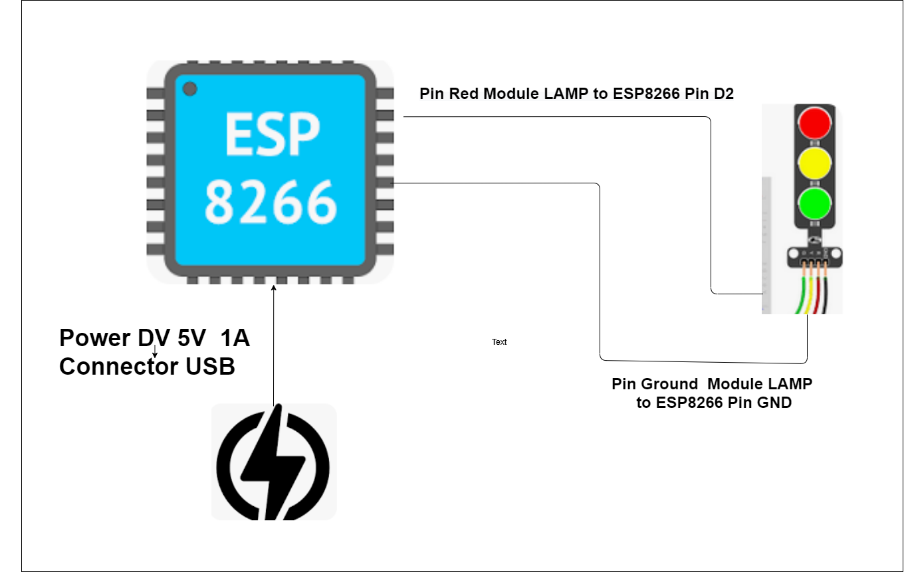

## 4. Software Requirements

- **Arduino IDE** – To upload code to the ESP8266  
- **ESP8266 Board Support** – Install using *Board Manager* in Arduino IDE  
- **Arduino Libraries** – `ESP8266WiFi`, `PubSubClient`, `ArduinoJson`  
- **MQTT Broker** – Mosquitto / HiveMQ (local or containerized)  
- **Apache / Nginx Web Server**   

## 5. Configuration and Deployment

### 5.1. MQTT Broker Deployment (Using Docker)

```bash
docker compose up -d
````

or

```bash
docker run -d --name mqtt-broker -p 1883:1883 hivemq/hivemq-ce
```

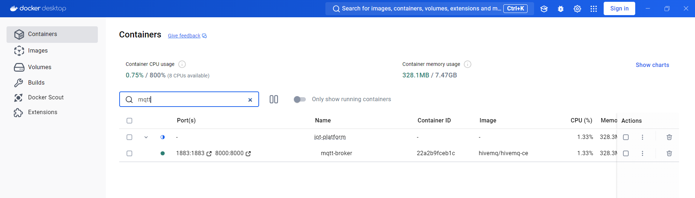

Broker will be available at:

```
mqtt://server-ip:1883
```


### 5.2. Arduino Code Configuration (main.ino)

Edit WiFi and MQTT details in `microcontroller/main/main.ino`:

```cpp
// REPLACE with your WiFi credentials
const char* ssid = "APxxxx"; 
const char* password = "Pxxxxxxx"; 

// REPLACE with your Local MQTT Broker IP
const char* mqtt_server = "xxx.xxx.xxx.xx"; 
const int mqtt_port = 1883;
```

### 5.3. Upload to ESP8266

1. Open `main.ino` in Arduino IDE
2. Go to **Tools → Board → ESP8266 Boards → NodeMCU 1.0 (ESP-12E Module)**
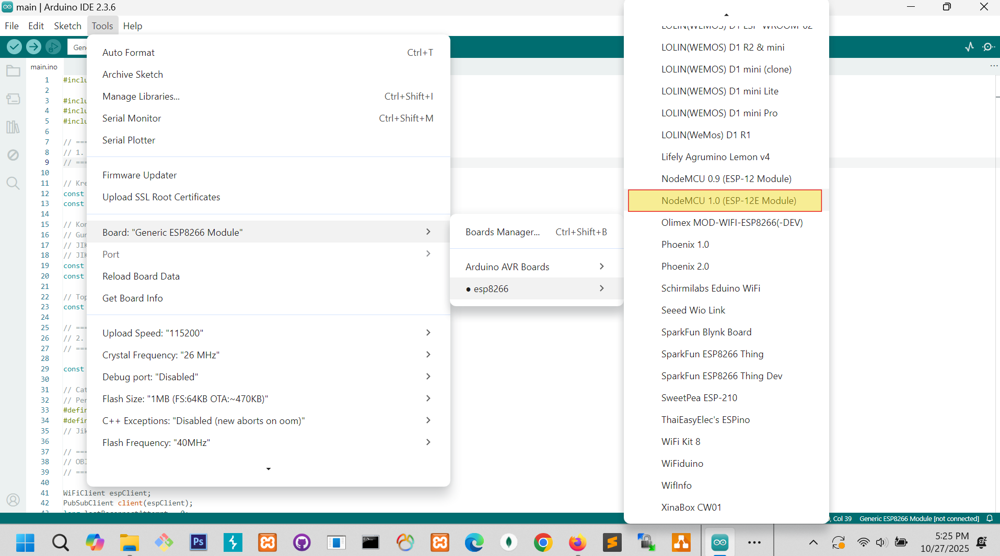

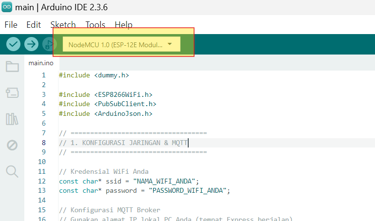

3. Select correct **COM Port**

4. Click **Upload (→)**

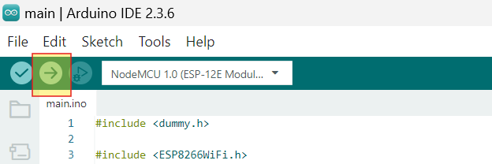

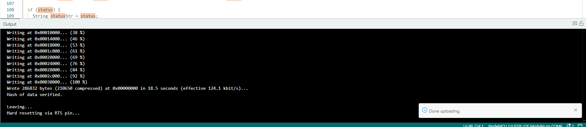

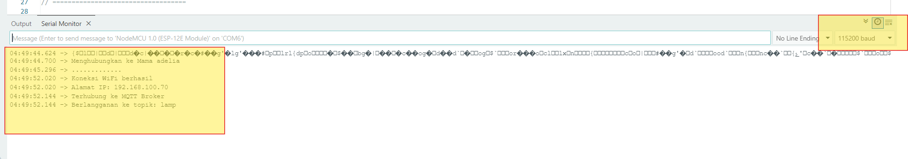


### Relay Logic

The system uses an **ACTIVE-LOW** setting:

```cpp
#define RELAY_ON LOW 
#define RELAY_OFF HIGH
```

### 5.4. MQTT Message Structure (Payload)

| Command | JSON Payload        | Result         |
| - | - | -- |
| **ON**  | `{"status": "on"}`  | Lamp turns ON  |
| **OFF** | `{"status": "off"}` | Lamp turns OFF |

**Topic used:** `lamp`


## 7. Frontend Application

Voice command control integration allows users to send command,  

Voice Input: User speaks a command (e.g., "Turn on Lamp").
Voice Recognition: A Smart Assistant device or app recognizes the speect to text google chrome integrated with Google Speach to Text
MQTT Bridge: A service translates the voice command into a text message and Publishes it to a dedicated MQTT command topic (e.g., pubs/lamp/).
ESP8266 Action: The ESP8266, which Subscribes to the command topic, processes the request (e.g., reads the command on / off).

<p align="left">
  
</p>

## 8. System Demonstration and Testing

### A. Confirming ESP8266 Connection

After uploading, open the **Serial Monitor** at `115200 baud` to check WiFi and MQTT connection logs.

### B. Sending Commands from the Publisher (Backend App / MQTT Client)

#### **Option 1: Using Backend Server (Node.js + Express)**

Run the backend:

```bash
cd backend
node app.js
```

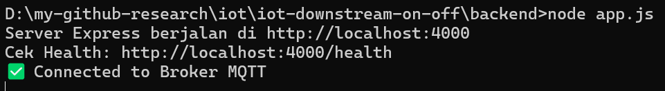


Send command via REST API:

```bash
POST http://localhost:4000/api/publish/lamp
Content-Type: application/json

{"status": "on"}
```

#### **Option 2: Using MQTT Client (MQTT Explorer)**

* Connect to: `xx.xx.xx.xx:1883`
* Publish to topic: `lamp`
* Payload: `{"status":"on"}` or `{"status":"off"}`


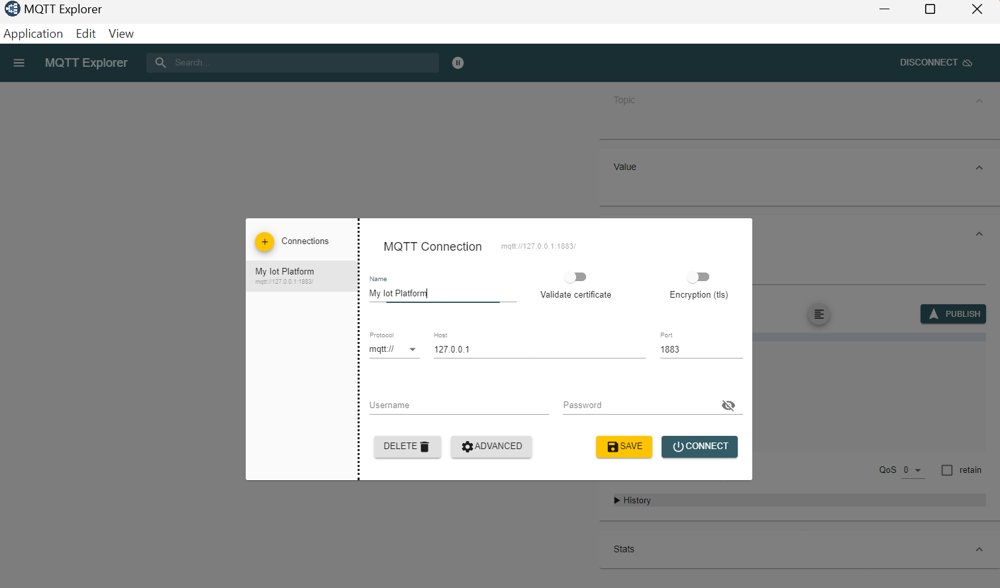

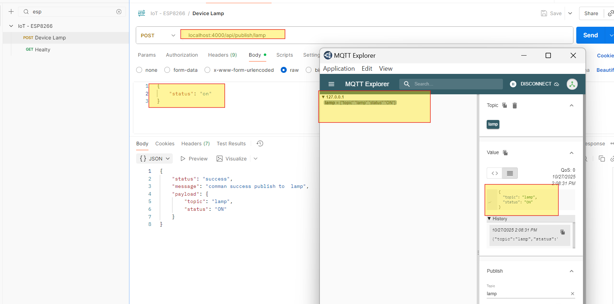


#### **Option 3: Frontend Application**

* Connect frontend application  via browser laptop / handphoe: `https://xx.xx.xx.xx:`
* Send Command via voice 

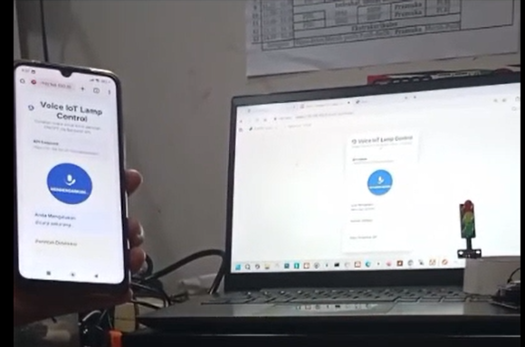

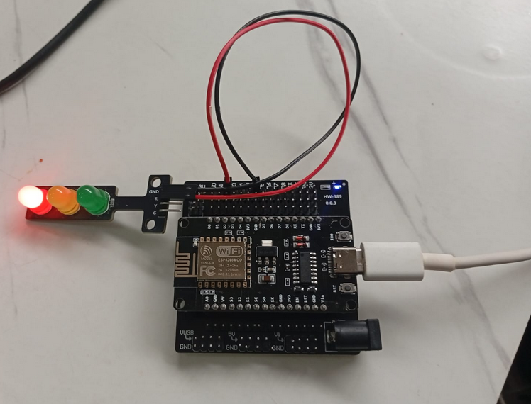


### C. Microcontroller Running Demo (Serial Monitor)

When a command is received and processed, the Serial Monitor will show:

```
Connected to WiFi
Connected to MQTT Broker
Message received: {"status":"on"}
Turning Lamp ON
```